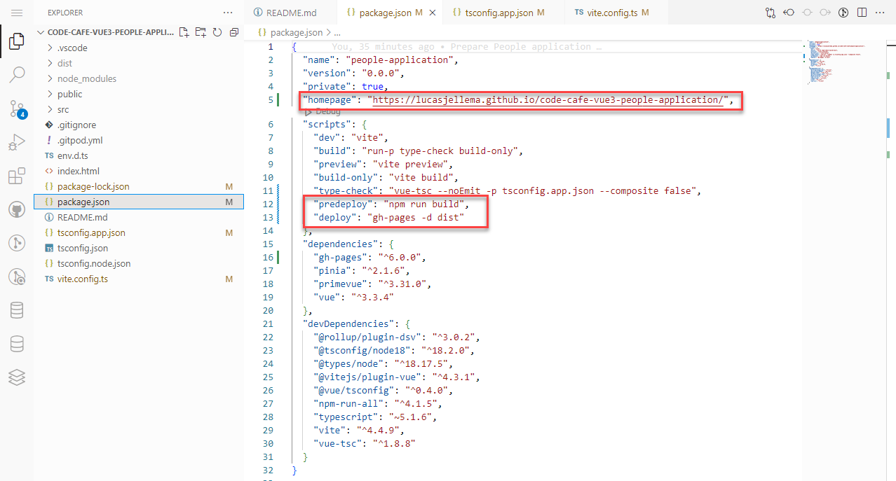
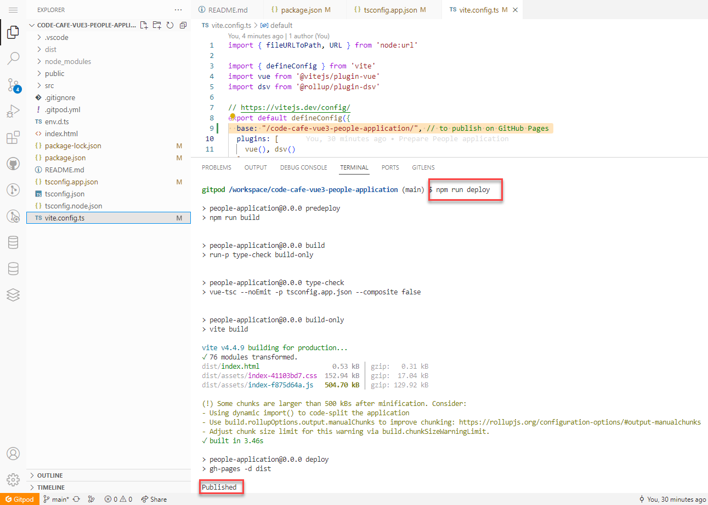
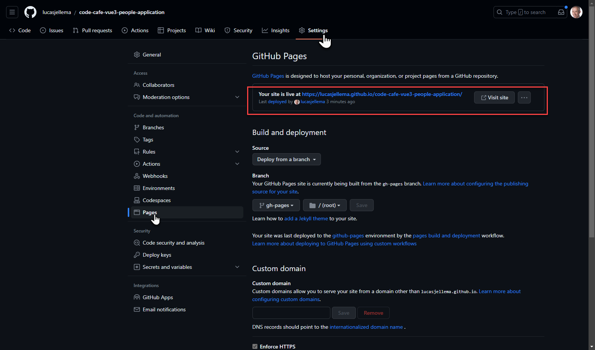
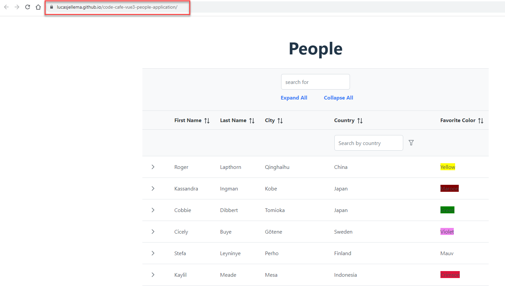

# code-cafe-vue3-people-application
Simple Vue 3 application with Pinia for state, Primevue for UI components

[](https://gitpod.io/#https://github.com/lucasjellema/code-cafe-vue3-people-application)

If you click on the button, you are prompted to launch a Gitpod workspace using a GitHub based authentication.

To run the People Application in development (hot module reload mode):

```
npm run dev
```

## To publish as GitHub Pages
(these instructions are inspired by: https://mkay11.medium.com/how-to-deploy-your-vite-vue-3-application-in-github-pages-2023-2b842f50576a)

Note: *you can only publish a GitHub Pages project in your own repository. So in order to be successful at these instructions, make sure that you have forked the GitHub repository and opened the Gitpod workspace for your fork.*

In the terminal run this command:
```
npm install gh-pages
```

add in package.json:

```
  "homepage": "https://YOUR_GITHUB_USERNAME.github.io/NAME_OF_REPOSITORY/",
```


in my case: `"homepage": "https://lucasjellema.github.io/code-cafe-vue3-people-application/",`

Also add in the *scripts* entry in packgage.json:

```
    "predeploy": "npm run build",
    "deploy": "gh-pages -d dist",
```



In file *vite.config.ts* add property *base* in the configuration:
```
  base: "/NAME_OF_REPOSITORY/",

```
for example:
```
  base: "/code-cafe-vue3-people-application/", 
```

That is all it takes!

Then, to publish the application, execute:
```
npm run deploy
```


This will build the application and subsequently start a GitHub Action in the repository that does the actual deployment. This can take a few minutes.  

Open the Vue application at homepage URL:

https://YOUR_GITHUB_USERNAME.github.io/NAME_OF_REPOSITORY/

or find link at GitHub Repo, Settings, Pages:

https://github.com/YOUR_GITHUB_USERNAME/NAME_OF_REPOSITORY/settings/pages



The application runs as it did before - at a publicly accessible URL:


